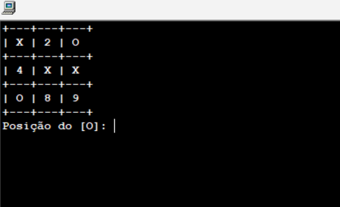

# Jogo da Velha em Portugol
Projeto simples de jogo da velha desenvolvido em Portugol como exercício de lógica de programação.

## OBJETIVO 

Praticar conceitos básicos de Algoritmo, como: 
- Matrizes 
- Estruturas de Repetição 
- Condições  
- Procedimentos

## COMO EXECUTAR?

- 1. Baixe o arquivo 'jogo_da_velha.alg' ou copie o código.
- 2. Abra no seu navegador o Visualg ou algum app ou site que rode Portugol.
- 3. Cole o código e execute.

## DEMONSTRAÇÃO

Desenvolvido no app Visualg.

Projeto feito durante meus estudos iniciais em programação.
